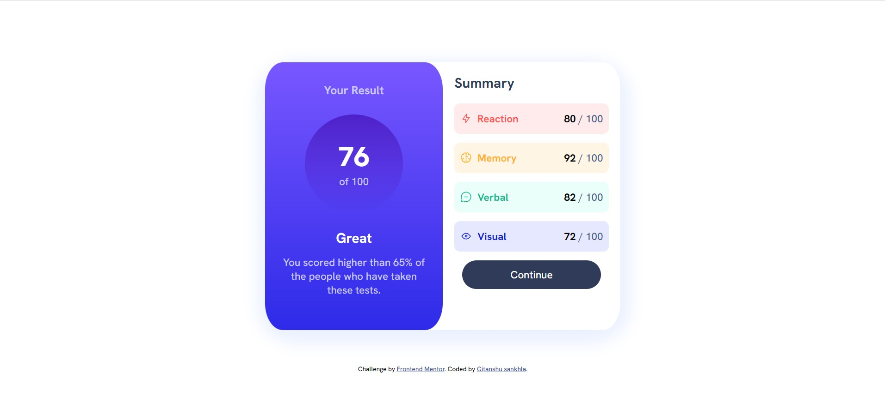

# Frontend Mentor - Results summary component solution

This is a solution to the [Results summary component challenge on Frontend Mentor](https://www.frontendmentor.io/challenges/results-summary-component-CE_K6s0maV). Frontend Mentor challenges help you improve your coding skills by building realistic projects. 

## Table of contents

- [Overview](#overview)
  - [The challenge](#the-challenge)
  - [Screenshot](#screenshot)
  - [Links](#links)
- [My process](#my-process)
  - [Built with](#built-with)
  - [What I learned](#what-i-learned)
  - [Useful resources](#useful-resources)
- [Author](#author)


## Overview

### The challenge

Users should be able to:

- View the optimal layout for the interface depending on their device's screen size
- See hover and focus states for all interactive elements on the page

### Screenshot




### Links

- Solution URL: [Add solution URL here](https://your-solution-url.com)
- Live Site URL: [live site](https://gitax18.github.io/scorecard-frontend-mentor/)

## My process

### Built with

- Semantic HTML5 markup
- CSS custom properties
- Flexbox
- Google Fonts
- Mobile-first workflow


### What I learned

This is my first frontend project which works absolutely perfectly, I learn a lot by creating this project.
the most difficult part for me in this project is the positioning of the contents, I take this as my challenge
and learn flexbox and its properties which solves my problems. I am sharing the code snippets which i am proud of: 

```html
<div class="reaction">
          <div class="box-right">
            <svg xmlns="http://www.w3.org/2000/svg" width="20" height="20" fill="none" viewBox="0 0 20 20"><path stroke="#F55" stroke-linecap="round" stroke-linejoin="round" stroke-width="1.25" d="M10.833 8.333V2.5l-6.666 9.167h5V17.5l6.666-9.167h-5Z"/></svg>
            <strong>Reaction</strong>
          </div>
          <p> <span class="right-scores">80</span> / 100</p>  
        </div>

        <div class="memory">
          <div class="box-right">
            <svg xmlns="http://www.w3.org/2000/svg" width="20" height="20" fill="none" viewBox="0 0 20 20"><path stroke="#FFB21E" stroke-linecap="round" stroke-linejoin="round" stroke-width="1.25" d="M5.833 11.667a2.5 2.5 0 1 0 .834 4.858"/><path stroke="#FFB21E" stroke-linecap="round" stroke-linejoin="round" stroke-width="1.25" d="M3.553 13.004a3.333 3.333 0 0 1-.728-5.53m.025-.067a2.083 2.083 0 0 1 2.983-2.824m.199.054A2.083 2.083 0 1 1 10 3.75v12.917a1.667 1.667 0 0 1-3.333 0M10 5.833a2.5 2.5 0 0 0 2.5 2.5m1.667 3.334a2.5 2.5 0 1 1-.834 4.858"/><path stroke="#FFB21E" stroke-linecap="round" stroke-linejoin="round" stroke-width="1.25" d="M16.447 13.004a3.334 3.334 0 0 0 .728-5.53m-.025-.067a2.083 2.083 0 0 0-2.983-2.824M10 3.75a2.085 2.085 0 0 1 2.538-2.033 2.084 2.084 0 0 1 1.43 2.92m-.635 12.03a1.667 1.667 0 0 1-3.333 0"/></svg>
            <strong>Memory</strong>
          </div>
          <p> <span class="right-scores">92</span> / 100</p>
        </div>

        <div class="verbal"> 
          <div class="box-right">
            <svg xmlns="http://www.w3.org/2000/svg" width="20" height="20" fill="none" viewBox="0 0 20 20"><path stroke="#00BB8F" stroke-linecap="round" stroke-linejoin="round" stroke-width="1.25" d="M7.5 10h5M10 18.333A8.333 8.333 0 1 0 1.667 10c0 1.518.406 2.942 1.115 4.167l-.699 3.75 3.75-.699A8.295 8.295 0 0 0 10 18.333Z"/></svg>
            <strong>Verbal</strong>
          </div>
          <p> <span class="right-scores">82</span> / 100</p>
        </div>

        <div class="visual">
          <div class="box-right">
            <svg xmlns="http://www.w3.org/2000/svg" width="20" height="20" fill="none" viewBox="0 0 20 20"><path stroke="#1125D6" stroke-linecap="round" stroke-linejoin="round" stroke-width="1.25" d="M10 11.667a1.667 1.667 0 1 0 0-3.334 1.667 1.667 0 0 0 0 3.334Z"/><path stroke="#1125D6" stroke-linecap="round" stroke-linejoin="round" stroke-width="1.25" d="M17.5 10c-1.574 2.492-4.402 5-7.5 5s-5.926-2.508-7.5-5C4.416 7.632 6.66 5 10 5s5.584 2.632 7.5 5Z"/></svg>
            <strong>Visual</strong>
          </div> 
```
```css
@media screen and (max-width:1200px) {
    main{
        flex-direction: column;
        width: 100%;
        height: 100%;
        margin: 0;
        margin-bottom: 60px;
    }
    .left-container{
        width: 100%;
        border-radius: 0 0 10% 10%;
    }
    .score{
        font-size: 2rem;
    }
    .score-container{
        width: 100px;
        height: 100px;
        font-size: 10px;
    }
    .greet{
        font-size: 1.2rem;
    }
    .right-container{
        width: 100%;
        border-radius: 0 0 10% 10%;
    }
}
```


### Useful resources

- [resource 1](https://developer.mozilla.org/en-US/docs/Learn/CSS/CSS_layout/Flexbox) - This helped me for learning flexbox.

## Author

- Github - [Gitanshu sankhla](https://github.com/Gitax18)
- Frontend Mentor - [@Gitanshu sankhla](https://www.frontendmentor.io/profile/gitanshu18)
- Instagram - [@lazydeveloper18](https://www.instagram.com/lazydeveloper18/)
